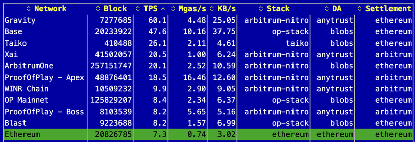
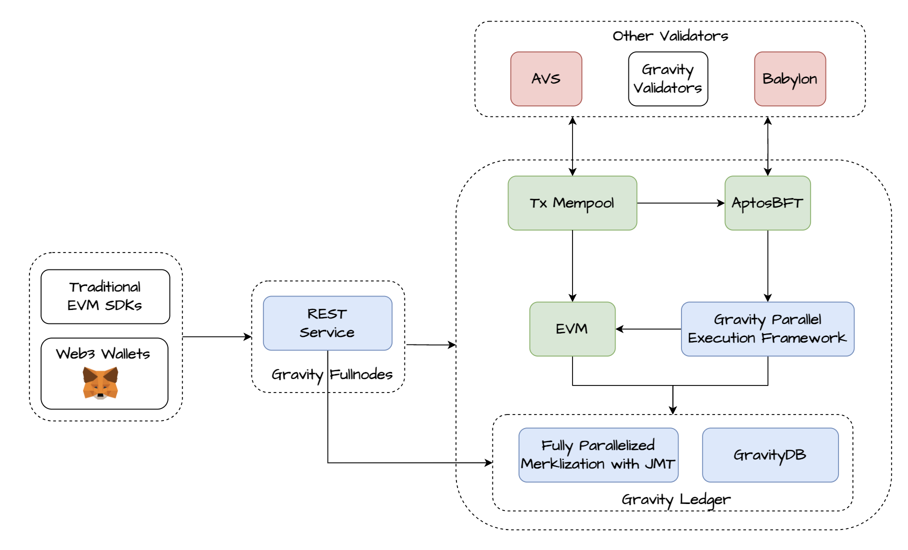
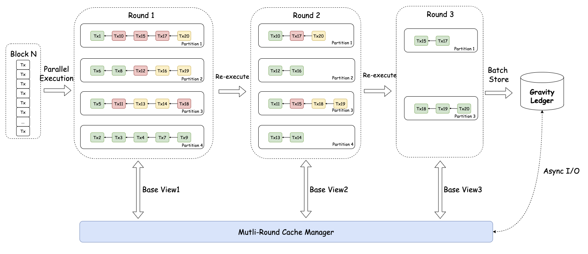
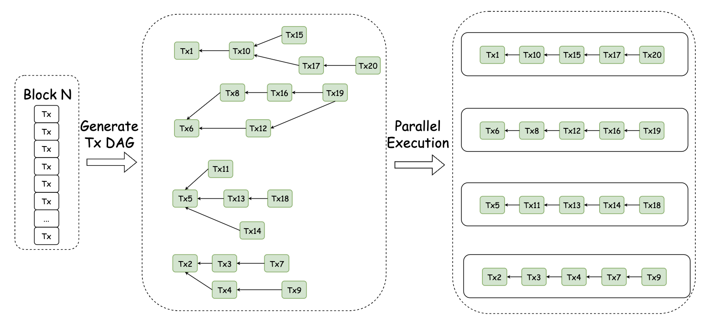

# Building Gravity Chain: A High-Performance EVM Layer 1 Powered by Grevm and Gravity SDK

## Abstract

**Gravity Chain** is a pioneering high-performance EVM-compatible Layer 1 blockchain designed for
mass adoption and an omnichain future. Offering **1 gigagas per second throughput**, **sub-second
finality**, and **restaking-powered PoS security**, Gravity Chain addresses the scalability and
performance challenges of modern blockchain applications. At its core, Gravity Chain is built using
the **Gravity toolkit**, which comprises two major components: (1) **Gravity SDK**, a **pipelined**
AptosBFT consensus engine, and (2) **Grevm (Gravity EVM)**, a parallel EVM runtime. The toolkit is
designed to empower web3 applications to launch their own alternative L1 blockchains, specifically
optimized for EVM-compatible chains while supporting any runtime, effectively offloading
transactions from the Ethereum mainnet. This paper introduces the engineering design and
technological innovations behind Gravity Chain, illustrating how the Gravity toolkit meets
high-performance demands through a combination of pipelined blockchain architecture, consensus
algorithm, parallel execution, and storage layers, specifically by augmenting
[reth](https://github.com/paradigmxyz/reth) and refining an open-source consensus engine from
[Aptos](https://github.com/aptos-labs/aptos-core).

## Introduction

**TL;DR:** Gravity toolkits are developed to address the challenges of throughput, finality, and
interoperability driven by Galxe ecosystem’s high transaction volume and the need of
near-instantaneous finality for Gravity Intent Protocol, with restaking-powered PoS security.

The development of Gravity toolkits was driven by the challenges we encountered with Galxe, a
leading Web3 application offering a suite of services such as loyalty points, campaign NFTs, token
rewards, zk-Identity, and omnichain smart savings. Galxe's rapid growth has resulted in a
significant volume of transactions, with its loyalty points system processing over 51.2 transactions
per second and token rewards campaigns processing over 32.1 transactions per second on average. As
we move towards decentralizing Galxe's backend, transitioning all its use cases to an EVM blockchain
while maintaining optimal user experience became challenging. This shift highlights the necessity
for a high-performance EVM blockchain capable of supporting (1) high transaction throughput, and (2)
near-instantaneous finality. Gravity toolkits was developed as the solution to these pressing needs,
offering a robust framework for building alternative Layer 1s (L1), especially EVM L1s, for the next
wave of web3 mass adoption.

Considering these performance demands, the decision to either utilize existing Layer 2 (L2)
solutions or create a new L1 chain was critical. The main trade-off revolves around how transaction
finality is formed: using a consensus algorithm, which defines an L1, or rollup protocols, which
categorize it as an L2. The trade-off is clear—L1s generally have lower theoretical throughput
because of running consensus algorithms. However, this also results in significantly faster
time-to-finality compared to L2s. For example, with a consensus algorithm like AptosBFT, finality
can be achieved in less than a second, whereas optimistic roll-ups can take up to seven days due to
the challenge period. Given Gravity’s need for near-instant finality—essential for Galxe UX and
particularly for the Gravity’s omnichain intent protocol—we decided to develop an L1.

Moreover, while L2s offer native support for messaging with Ethereum, L1 chains like Gravity can
provide comparable, and even more extensive, interoperability through the Gravity Intent Protocol
and cross-chain bridges built by players of the Ethereum ecosystem. This approach not only enables
seamless communication with Ethereum but also extends interoperability to other blockchain networks,
enhancing the overall connectivity of the whole web3 ecosystems.

Furthermore, with the adoption of restaking protocols, bootstrapping a Proof-of-Stake (PoS) L1
blockchain is no longer as challenging as it once was. By integrating restaking protocols like
EigenLayer and Babylon, L1s can tap into the vast staked value of Ethereum and Bitcoin and their
extensive validator networks. The economic trust provided by these restaking protocols from the
outset serves as a solid foundation for PoS consensus, enabling L1s to achieve similar levels of
decentralization and security to that of Ethereum.

### Call for 1 gigagas per second throughput

The most critical performance requirement for any blockchain is its throughput, typically measured
in transactions per second (TPS) or gas per second (gas/s). Using Galxe's loyalty points system as
an example, the system demands a minimum throughput of 4 million gas/s to function effectively. This
estimate is based on the average gas usage per loyalty point transaction (80,000 gas) and the
observed transaction rate of 51.2 transactions per second, which collectively equates to 4 million
gas/s.

This estimate is further validated by real-world data from Gravity Alpha Mainnet, our experimental
Layer 2. All loyalty points transactions on Gravity Alpha Mainnet have consistently demonstrated a
throughput of approximately 4 million gas/s, confirming the above estimation.

While this demand is expected to decrease slightly due to the higher costs associated with on-chain
operations, The growth trajectory of Galxe suggests that during peak periods, the demand could
easily reach two to three times the current level. Additionally, when factoring in other
applications such as NFTs, token rewards, and future on-chain functionalities like fully on-chain
questing powered by zero-knowledge proofs, the blockchain must be able to sustainably handle a
throughput of 50 million gas/s, if Galxe becomes a fully on-chain DApp. If we assume a Pareto
distribution of gas usage of applications on the [Gravity chain](https://gravity.xyz/), similar to
how Uniswap consistently consumes [10% of Ethereum's gas usage](https://etherscan.io/gastracker),
the chain should ideally support a sustainable throughput of 500 million gas/s to accommodate the
broader ecosystem applications like cross-chain settlement for smart saving LSD, loyalty points
trading DEXs, and NFT marketplaces. Given these estimations, it becomes clear that to meet the
demands of applications in the ecosystem, we need an EVM blockchain of 1 gigagas per second
throughput. This ensures that the performance ceiling is high enough to accommodate even more
resource-intensive applications, enabling them to scale without being constrained by the chain’s
capabilities.

### Sub-second Finality

In addition to throughput, the blockchain's finality time is a critical factor in maintaining a
positive user experience. Users expect near-instantaneous responses similar to what they experience
with centralized backends, just like web2 apps. In this regard, Galxe's requirements are akin to
those of fully on-chain games, where low latency is crucial, though not as extreme. Current EVM
blockchains, with time-to-finality ranges from several seconds to days, are far from meeting these
expectations. We choose AptosBFT as the consensus algorithm choice for achieving such sub-second
finality.

### Restaking PoS security

Scaling Ethereum securely isn’t limited to L2 rollups. The Gravity SDK deliberately opts for a
restaking-secured L1 architecture to balance **security**, **throughput**, **time-to-finality** and
**interoperability**. Central to this strategy is a modular restaking framework that integrates
multiple restaking protocols, such as EigenLayer and Babylon, which provide the economic trust
necessary to bootstrap and sustainably power a robust Proof-of-Stake (PoS) consensus.

**Security:** By leveraging **economic trust** that is programmable on well-established networks,
Gravity SDK taps into: (1) Ethereum's $45 billion in staked value and 850,000 validators through
building an Actively Validated Service (AVS) on Ethereum, based on EigenLayer, and (2) Bitcoin's
$600 billion assets via Babylon’s integration, using cryptographic primitives like EOTS. This
provides a secure foundation for PoS consensus from the outset, by extending security from
well-established networks like Ethereum and Bitcoin, effectively addressing the typical challenges
of bootstrapping new PoS blockchains, long-range attacks, and potential risks associated with any
single assets like long-term sustainability.

**Throughput and Time-to-Finality:** While L2 rollups can theoretically achieve higher throughput by
eliminating the need for consensus, they typically introduce significant delays in finalizing
transactions due to the challenge period. This latency is problematic for applications requiring
near-instantaneous finality, like Galxe. Some DApps, such as cross-chain bridges, attempt to
mitigate this by using "trust" modes, implementing external monitoring systems—like running a
sequencer replica to check invariances—and bypassing the challenge period. However, these approaches
introduce additional risks and complexities.

Gravity SDK narrows the throughput gap between L2 rollups and L1 by implementing a 5-stage pipeline,
which parallelizes consensus for the next block and execution for the current block (see more
details in the pipelining section).

**Interoperability:** The Gravity SDK’s restaking-secured L1 architecture supports our vision of
seamless blockchain interoperability. Unlike L2s, which rely on a canonical bridge with Ethereum,
L1s built on Gravity SDK can achieve broader cross-chain interoperability using the Gravity
cross-chain intent protocol. This enables communication not only with Ethereum but also with other
connected L1s and L2s, fostering a truly interconnected web3 ecosystem.

## Architecture

<!-- update this image to gravity chain arch -->

Our development of the Gravity toolkits focuses on two main components: (1) refining the open-source
consensus engine from Aptos to establish the foundation of L1 blockchain, and (2) optimizing the
Reth framework in several key areas, including parallel computation, pipelining and storage
optimization, all aimed at improving throughput.

## Gravity SDK: A blockchain framework refined from the Aptos chain

Gravity SDK is an open-source, modular blockchain framework designed to modularize the existing
architecture of the Aptos blockchain. Borrowing battle-tested components from Aptos, such as the
Quorum Store mempool and consensus engine (AptosBFT), Gravity SDK presents a pipelined blockchain
consensus engine. The framework is structured around a pipelined architecture that allows for the
efficient processing of blockchain tasks, making it a powerful SDK for next-generation EVM
blockchains.

- Pipelined architecture
- Network and mempool
  - Transaction dissemination (Quorum store)， P2P network，mempool，state sync and etc.
- Consensus: AptosBFT
- Native staking & Restaking module
- Execution layer adaptors
  - Grevm (Gravity EVM), a fork of reth with parallel execution and transaction dissemination
    support
  - Reth

### Pipelined architecture

Gravity SDK utilizes a 5-stage pipelined architecture to maximize hardware resource utilization, for
higher throughput, and lower latency. This architecture interleaves the execution of tasks across
different blocks, allowing parallel processing tasks without dependencies. The stages include:

1. Transaction dissemination.
2. Block metadata ordering (consensus)
3. Execution.
4. (Parallel) State commitment.
5. State Persistence.

### Network and consensus layer

Gravity SDK retains the robust network and consensus layer of Aptos, which have demonstrated
[exceptional results](https://www.ccn.com/news/crypto/aptos-breaks-records-with-115-4-million-transactions-in-one-day/)
in production environments. This includes transaction dissemination, P2P networking, mempool
management, and state synchronization.

### Execution layer: reth

<!-- TODO: Gravity supports any runtime -->

The execution layer in Gravity SDK is built around reth, enabling full Ethereum Virtual Machine
(EVM) compatibility. This integration opens Gravity SDK to the Ethereum ecosystem, including
wallets, decentralized applications (DApps), and developer tools, while maintaining the high
performance of a L1 network.

To further enhance performance and create a ‘real-time’ blockchain, we are developing four major
optimizations for reth, see the section below for more details.

- Pipelined block process
- Parallel execution
  - Using Block-STM with hint-driven partition
- Gravity ledger layer
  - The Fully parallelized state commitment enables rapid State Commitment generation.
  - The Gravity DB, integrated with the pipeline and asynchronous I/O, ensures optimized data
    persistence without blocking other processes. Along with advanced encoding, compression, and
    indexing techniques to implement a more efficient caching strategy, we plan to introduce
    database sharding, featuring a version-based key that circumvents heavy I/O brought about by the
    randomness of a pervading hash-based key.

## Innovating with reth

### Grevm (Gravity EVM) - Parallel EVM Execution

The parallel Ethereum Virtual Machine (EVM) offers the potential to unlock the scalability potential
by facilitating parallel transaction execution. This approach takes advantage of the fact that
independent transactions can be processed simultaneously, significantly boosting throughput by by
multithreading.

The core idea involves running multiple EVM instances concurrently on different threads. These
instances execute batches of transactions independently, and their results are merged into a final
state update.

1. **Transaction Scheduling and Dependency Management:** Efficiently partition transactions across
   multiple EVM instances while accurately detecting and handling dependencies to ensure
   conflict-less execution.
2. **Optimizing Parallelism:** Develop strategies to maximize the parallel processing of independent
   transactions.
3. **Efficient State Loading and Merging:** Providing non-blocking ledger views to each EVM process
   instance, significantly enhancing the concurrency of Parallel EVM.

**Architecture of Parallel EVM Framework of Gravity**

We retains the workflow of Block-STM and enhances it to develop the Parallel EVM Framework suitable
for EVM, with the following technical innovations:

1. Efficient transaction dependencies analysis
2. Deterministic parallel execution algorithm
3. Multi-round transactional cache manager

**Efficient transaction dependencies analysis**

For transactions in a block, by introducing speculated read/write sets, we can form a transaction
dependency graph to partition them into different batches. As illustrated in the diagram, batches
will be dispatched to multiple execution instances and leverage the multi-core advantages of CPUs to
achieve efficient transaction processing.

Tx Dependencies Analysis

**Deterministic Transaction Algorithm**

Each round categorizes transactions into three states: `Finalized`, `Conflicting`, and `Pending`.
Only transactions that have all preceding transactions finalized and are conflict-free can be
considered `Finalized`. For each round, the algorithm dynamically re-partitions the Parallel
Execution Instances based on the `Conflicting`and `Pending` transaction set from the previous round.
With each successive round, the Read-Write set becomes more precise, allowing convergence within a
limited time. In extreme cases, after K rounds, the process may fall back to serial execution to
prevent the worst case scenarios where the theoretical time complexity becomes O(n^2). However, by
that point, most memory slots used by transactions are already loaded in memory, making serial
execution highly efficient.

For `Pending` transactions, we can avoid redundant execution by reusing read-write set information,
as illustrated in the flowchart below:

Workflow of Tx Re-Execution

**Multi-Round Cache Manager**

We provide a transactional database manager for each round, aiming to quickly offer a precise Ledger
Base View for the Parallel Execution of each round while leveraging the async I/O capabilities of
the database.

Diagram of Multi-Round Cache Manager

As shown in the diagram, the `Finalized` Tx of each round will be merged into the Base View, while
the `Conflicting` and `Pending` Tx will continue to execute based on this new Base View.

**The last round of Base View is the Finalized View of the block.**

Diagram of Merge Definite View

### Fully Parallelized State Root Framework

The generation of Merkle Roots has become a significant bottleneck in the block creation process for
most L1 and L2 blockchains. In systems like Monad, the
[**Deferred Execution**](https://docs.monad.xyz/technical-discussion/consensus/deferred-execution)
strategy is employed to mitigate performance impacts, while in Reth, the concepts of
[**Fully Parallelized State Root**](https://www.paradigm.xyz/2024/04/reth-perf) and Pipelined State
Root have been introduced to address this challenge.

We acknowledges the potential of these approaches and has conducted Proof of Concept (POC)
experiments on the Fully Parallelized State Root. However, the initial results were not entirely
satisfactory, primarily due to the following reasons:

1. **Transaction type distribution:** The majority of L1 and L2 transactions still consist of native
   transfers and ERC20 operations. When the number of transactions in a block is low, the number of
   Merkle Trees that can be parallelized is also limited. Additionally, the WorldState Root must
   wait for all Storage Tree Roots to complete their calculations.
2. **Block size:** The Parallelized State Root framework shows less effective performance with
   smaller blocks. Its benefits are more when the Write Set is substantial.

Based on these insights, we have developed a **Fully Parallelized State Root Framework** that
optimizes Merkle Root generation for both large and small blocks. By enabling parallel processing at
both the multiple Storage Tree level and within individual Storage Trees, and by extending the
Merkle Tree primitives, this framework can effectively reduce the time for state commitment.

**Parallelization of Multiple Storage Trees**

To achieve effective parallelization, the Merkle Tree structure has been extended with the following
primitives:

1. **Deferred hash computation:** The Merkle Tree structure is managed in memory, where all
   insertions, deletions, and updates are applied to the tree as usual. However, instead of
   immediately computing the hash, these nodes are simply marked as "dirty."
2. **Parallel hash computation:** For all nodes marked as dirty, a Parallel State Calculation
   algorithm is employed to divide the tree into multiple subtrees. These subtrees are processed in
   parallel, and the results are then aggregated at the top level to form the final Merkle Root.

The framework first tackles the parallelization at the level of multiple Storage Trees, where
multiple Storage Trees can be processed simultaneously. This approach is particularly effective in
scenarios with larger blocks, where the number of transactions and state changes are significant.

**Internal Parallelization within a Single Storage Tree**

The framework also includes enhancements for parallelization within a single Storage Tree. This
ensures that both large and small blocks can benefit from the parallel processing of state updates.

**Multi-Version State Manager**

Given the need to balance performance and latency, we propose the use of a **Multi-Version State
Manager** to handle the read and write operations of the Merkle Tree. This approach allows for the
persistent commit of changes to be deferred to a more appropriate time (possibly after 10 blocks or
longer), while still ensuring that the Fully Parallelized State Root operates effectively, and
potentially even faster. However, this method requires a larger memory capacity to accommodate the
delayed persistence.

### Storage optimization: GravityDB

In the redesigned architecture of GravityDB, we retain the definitions of Validator, Full Node, and
Light Client as seen in the Aptos model. However, acknowledging that Validators should prioritize
resources for state machine transitions, we propose a lighter database solution for Validators. This
approach maintains an efficient blockchain network while preserving decentralization and enabling
rapid node startup.

This architecture not only optimizes resource allocation but also enhances the overall network
performance by clearly delineating the roles of Validators and Full Nodes. By integrating state
sharding and providing economic incentives, GravityDB ensures a scalable, secure, and decentralized
blockchain environment that can adapt to the evolving needs of the ecosystem.

**State Commitment Store (SC Store) and State Storage Store (SS Store) Separation**

**SC Store (for Validators):** This layer is responsible for managing the world state corresponding
to the latest finality block, enhancing the efficiency of transaction execution and Merklization by
focusing resources (CPU, network, I/O) on state transitions and block generation.

- **Separation of Transaction Execution and Merklization Data:** This design supports the Pipeline
  Block Process.
- **Persistent Compression:** Most Merkle Trees are structured as 16-way or binary trees, with
  individual node sizes typically ranging from tens to hundreds of bytes. GravityDB implements a
  Data Page structure that stores subtree batches in the database without affecting the in-memory
  expansion results.

**SS Store (for Full Nodes and Archive Nodes):** This layer contains all historical states and
provides comprehensive multi-version query capabilities.

- **Full Nodes:** Store versioned raw key/value pairs, but do not support Historical Proofs.
- **Archive Nodes:** Utilize a Version-Based Trie structure to support Historical Proofs.

In traditional blockchain models, Validators are burdened with both SC and SS duties. By decoupling
these responsibilities, we streamline the Validator's role, aligning with the core philosophy behind
Gravity DB's design.

**Workflow**

As illustrated above, Validators only maintain the Latest Ledger necessary for normal block
generation. The resulting ChangeSet is synchronized with Full Nodes. When needed, Validators can
sync states from Full Nodes to update the latest SC.

**State Sharding for Scalability and Performance**

To meet the demands of larger scales and higher performance, we introduce **State Sharding** within
SS and SC. Unlike traditional state sharding, our approach focuses on sharding at the **Merkle
State** level. All SS or SC within the same Merkle Tree are grouped into the same Sharded SS/SC,
ensuring coherence and efficient state management.

This Merkle State-based sharding allows for more granular and flexible state management, enhancing
the network's ability to handle high volumes of transactions and state updates without compromising
on speed or security.

### Pipelined Block Process

The Pipelined Block Process is designed to optimize transaction processing, block generation, and
state management for L1s built by Gravity SDK. This process is divided into five distinct stages,
each focusing on a specific aspect of the block lifecycle. The design decouples the transaction
dissemination and consensus mechanisms, following the idea from
[Narwhal & Tusk](https://arxiv.org/abs/2105.11827) and
[Aptos](https://aptosfoundation.org/whitepaper/aptos-whitepaper_en.pdf), as well as advanced
parallel execution and state management strategies.

**Stage 1: Transaction Dissemination**

- **Objective:** Efficiently disseminate transactions across validators to ensure timely and
  reliable inclusion during execution.
- **Process:**
  - Validators continuously share batches of transactions, utilizing all network resources
    concurrently. A proof of availability (PoAv) is formed when a batch receives 2f + 1
    stake-weighted signatures, ensuring that the batch is stored by at least f + 1 honest
    validators, making it retrievable for execution by all honest validators.

**Stage 2: Block Metadata Ordering**

- **Objective:** Establish a consistent and agreed-upon order for transactions and blocks within the
  network.
- **Process:**
  - The consensus mechanism (based on AptosBFT) orders transactions and generates block metadata,
    including block height, timestamp, and the previous block hash.
  - This stage ensures that all nodes in the network agree on the order of transactions and the
    structure of the block, providing the foundation for subsequent execution.
  - The ordered transactions are then passed to the execution stage, ready for parallel processing.

**Stage 3: Parallel Transaction Execution**

- **Objective:** Execute transactions in parallel to maximize processing efficiency while ensuring
  consistency and correctness.
- **Process:**
  - Please refer to the Parallel Execution section above.

**Stage 4: State Commitment**

- **Objective:** Finalize the state changes resulting from transaction execution and prepare for
  block finalization.
- **Process:**
  - Please refer to the Fully Parallelized State Root Framework above.

**Stage 5: State Persistence**

- **Objective:** Persist the committed state changes to the blockchain's storage.
- **Process:**
  - The finalized State Root and associated data are stored in the Gravity Store, which uses a
    highly optimized storage engine designed for fast access and reliability.

Pipelined block processing

The Pipelined Block Process in Gravity enables operations like Transaction Dissemination, Block
Metadata Ordering, and Parallel Transaction Execution to proceed concurrently, avoiding blockages
from earlier stages.

The State Store is used as the final stage, reducing the latency to 20% of its original length, with
the block's duration determined by the longest stage. Moreover, State Store operations can be
deferred, by leveraging deterministic consensus for accurate state replay, allowing continuous
transaction processing.

Given the higher priority of transaction execution in a real-time blockchain environment, we have
incorporated priority queues and Dynamic Tuning strategies into the Pipeline Block Process:

1. **Priority Execution:** Transaction Dissemination, Block Metadata Ordering, and Parallel
   Transaction Execution are assigned the highest priority. In high-concurrency scenarios, State
   Commitment and State Persistence can be deferred by several blocks to ensure that critical
   operations are executed promptly.
2. **Dynamic Tuning:** The Pipeline Schedule dynamically adjusts Consensus Batch Sizing based on
   network load and transaction volume. This adaptive approach optimizes the balance between TPS
   (Transactions Per Second) and latency, ensuring that performance metrics are maintained at
   optimal levels.
