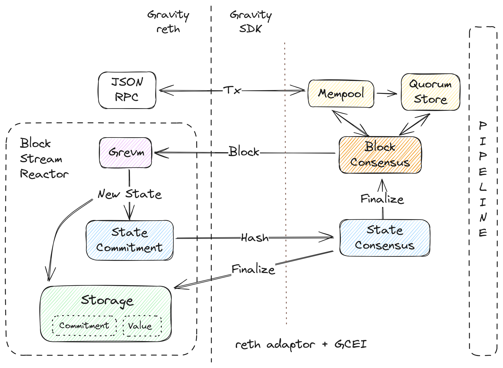
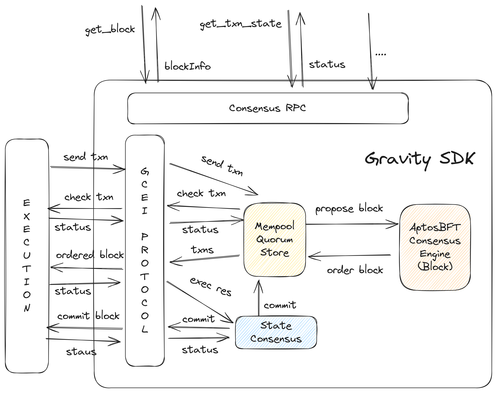
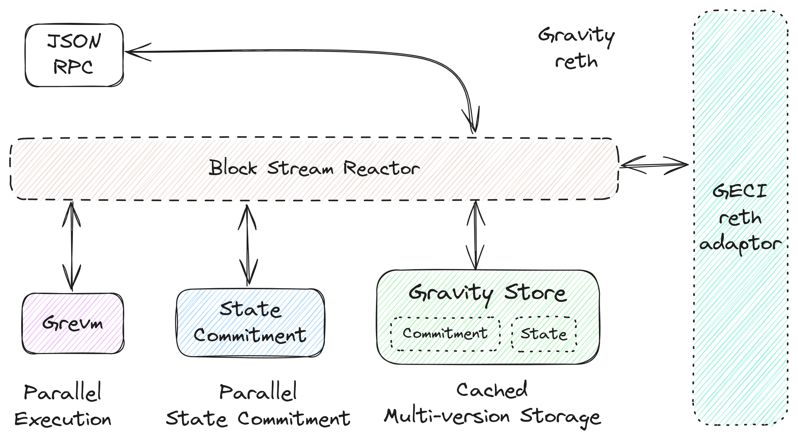
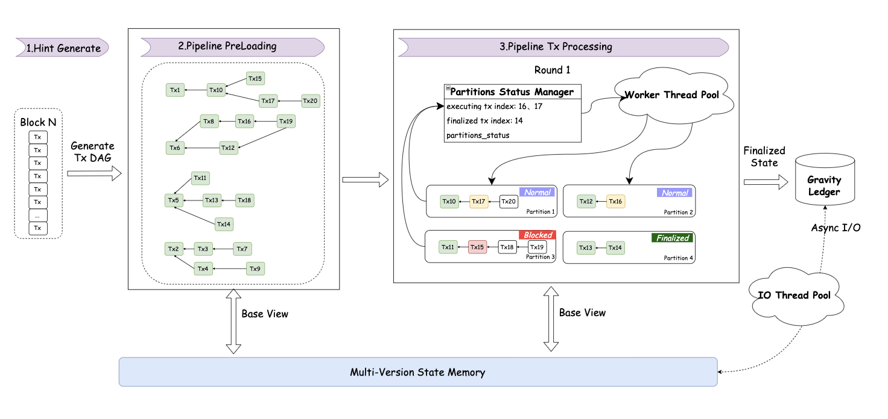
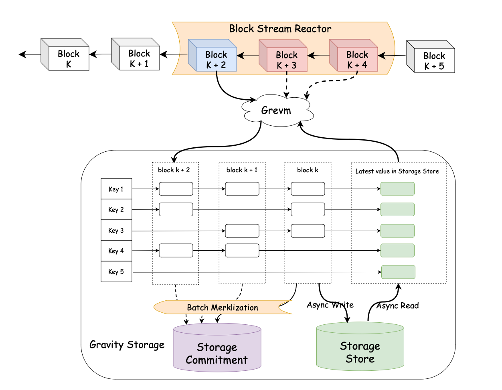

# Building Gravity Chain: A High-Performance EVM Layer-1 Powered by Grevm and Gravity SDK

## Abstract

**Gravity Chain** is a pioneering high-performance EVM-compatible layer-1 blockchain designed for
mass adoption and an omnichain future, built by Galxe. Offering **1 gigagas per second throughput**,
**sub-second finality**, and **restaking-powered PoS security**, at its core, Gravity is built using
two major open source components: (1) **Gravity SDK**, a restaking-powered **pipelined** AptosBFT
PoS consensus engine, and (2) **Gravity reth**, a Block Stream Reactor (BSR) execution layer powered
by our parallel EVM **Grevm (Gravity EVM)**. They are designed to empower web3 applications to
launch their own alternative L1s and faster-finality L2s, specifically optimized for EVM chains.
This paper introduces the engineering design and technological innovations behind Gravity,
illustrating how the Gravity meets high-performance demands through a combination of pipelined
architecture, state-of-the-art consensus algorithm, parallel execution, and highly optimized storage
layer, specifically by augmenting [reth](https://github.com/paradigmxyz/reth) and refining an
open-source consensus engine from [Aptos](https://github.com/aptos-labs/aptos-core).

## Introduction

The development of Gravity was initially driven by the challenges we encountered with Galxe, a
leading Web3 application offering a suite of services such as loyalty points, campaign NFTs, token
rewards, zk-identity, and omnichain smart savings. Galxe's rapid growth has resulted in a
significant volume of transactions, with its loyalty points system processing over 51.2 transactions
per second and token rewards campaigns processing over 32.1 transactions per second on average. As
we move towards decentralizing Galxe's backend, transitioning all its use cases to an EVM blockchain
while maintaining optimal user experience became challenging. This shift highlights the necessity
for a high-performance EVM blockchain capable of supporting (1) high transaction throughput, and (2)
near-instantaneous finality.

Considering these performance demands, the decision to either adopt existing L2 solutions or develop
a new Layer-1 chain is a critical. The core trade-off lies in the approach to achieving transaction
finality: using a consensus algorithm, which defines an L1, or rollup protocols, which categorize as
an L2. The trade-off is clear—L1s generally have lower theoretical throughput because of the cost of
consensus algorithms. However, this also results in significantly faster time-to-finality compared
to L2s. For example, with a consensus algorithm like AptosBFT, finality can be achieved in
sub-second, whereas optimistic roll-ups can take up to seven days due to the challenge period. Even
with using zero-knowledge proof to speed up this process, the time-to-finality remains in the order
of hours. Given Gravity's need for near-instant finality—essential for Galxe user experience and
particularly for the Gravity's omnichain intent protocol—we decided to develop an L1.

Moreover, while L2s offer native support for messaging with Ethereum, L1 chains like Gravity can
provide comparable, and even more extensive, interoperability through the Gravity Intent Protocol
and cross-chain bridges built by players of the Ethereum ecosystem. This approach not only enables
seamless communication with Ethereum but also extends interoperability to other blockchain networks,
enhancing the overall connectivity of the whole web3 ecosystems.

Furthermore, with the adoption of restaking protocols, bootstrapping a Proof-of-Stake (PoS) L1
blockchain is no longer as challenging as it once was. By integrating restaking protocols like
EigenLayer and Babylon, L1s can tap into the vast staked value of Ethereum and Bitcoin, and their
extensive validator networks. The economic trust provided by these restaking protocols from the
outset serves as a solid foundation for PoS consensus, enabling Gravity to achieve similar levels of
decentralization and security to that of Ethereum.

In light of these considerations, we decided to build Gravity, a high-performance EVM-compatible
layer-1 blockchain, to meet the scalability and performance demands of modern web3 applications.
Although the development of Gravity was initially driven by the needs of Galxe, the Gravity SDK and
Grevm (Gravity EVM) are designed to offering a flexible framework for building alternative L1s and
faster-finality L2s, just like Tendermint/Cosmos SDK.

### Call for 1 gigagas per second throughput

The most critical performance requirement for any blockchain is its throughput, typically measured
in transactions per second (TPS) or gas per second (gas/s). Using Galxe's loyalty points system as
an example, the system demands a minimum throughput of 4 million gas/s to function effectively. This
estimate is based on the average gas usage per loyalty point transaction (80,000 gas) and the
observed transaction rate of 51.2 transactions per second, which collectively equates to 4 million
gas/s.

This estimate is further validated by real-world data from Gravity Alpha Mainnet, our experimental
Layer 2. All loyalty points transactions on Gravity Alpha Mainnet have consistently demonstrated a
throughput of approximately 4 million gas/s, confirming the above estimation.

While this demand may decrease slightly due to the higher costs associated with on-chain operations,
The growth trajectory of Galxe suggests that during peak periods, the demand could easily reach two
to three times the current level. Additionally, when factoring in other applications such as NFTs,
token rewards, and future on-chain functionalities like fully on-chain questing powered by
zero-knowledge proofs, the blockchain must be able to sustainably handle a throughput of 50 million
gas/s, if Galxe becomes a fully on-chain DApp. If we assume a Pareto distribution of gas usage of
applications on the [Gravity chain](https://gravity.xyz/), similar to how Uniswap consistently
consumes [10% of Ethereum's gas usage](https://etherscan.io/gastracker), the chain should ideally
support a sustainable throughput of 500 million gas/s to accommodate the broader ecosystem
applications like cross-chain settlement for smart saving LSD, loyalty points trading DEXs, and NFT
marketplaces. Given these estimations, it becomes clear that to meet the demands of applications in
the ecosystem, we need an EVM blockchain of 1 gigagas per second throughput. This ensures that the
performance ceiling is high enough to accommodate even more resource-intensive applications,
enabling them to scale without being constrained by the chain's capabilities.

One of the critical parts of achieving such throughput is the parallel EVM. We have developed Grevm,
a parallel EVM execution runtime, which is the fastest open-source parallel EVM implementation to
date in our benchmark (see more details in the Grevm section below).

### Sub-Second Finality

In addition to throughput, the blockchain's finality time is a critical factor in maintaining a
positive user experience. Users expect near-instantaneous responses similar to what they experience
with centralized backends, just like web2 apps. In this regard, Galxe's requirements are akin to
those of fully on-chain games, where low latency is crucial, though not as extreme. Current EVM
blockchains, with time-to-finality ranges from several seconds to days, are far from meeting these
expectations. We choose AptosBFT as the consensus algorithm choice for achieving such sub-second
finality.

While L2 rollup can theoretically achieve higher throughput by eliminating the need for consensus,
they typically introduce significant delays in finalizing transactions due to the challenge period.
This latency is problematic for applications requiring near-instantaneous finality, like Galxe. Some
DApps, such as cross-chain bridges, attempt to mitigate this by using "trust" modes, implementing
external monitoring systems—like running a sequencer replica to check invariance—and bypassing the
challenge period. However, these approaches introduce additional risks and complexities, which is
not ideal for security-critical applications. To narrow the throughput gap between L2 rollup and L1,
after introducing consensus, the Gravity SDK implemented a 5-stage pipeline, which parallelizes
consensus for the next block and execution for the current block (see more details in the pipelining
section).

### Restaking PoS security

Scaling Ethereum securely is not limited to L2 rollup. The Gravity SDK deliberately opts for a
restaking-secured L1 architecture to balance **security**, **throughput**, **time-to-finality** and
**interoperability**. Central to this strategy is a restaking module that integrates multiple
restaking protocols, such as EigenLayer and Babylon, which provide the economic trust necessary to
bootstrap and sustainably power a robust Proof-of-Stake (PoS) consensus.

By leveraging **economic trust** that is programmable on well-established networks, Gravity and
chains built on Gravity SDK tap into: (1) Ethereum's $45 billion in staked value and 850,000
validators through building an Actively Validated Service (AVS) on Ethereum, based on EigenLayer,
and (2) Bitcoin's $600 billion assets via Babylon's integration, using cryptographic primitives like
extractable one-time signature (EOTS). This provides a secure foundation for PoS consensus from the
outset, by extending security from well-established networks like Ethereum and Bitcoin, effectively
addressing the typical challenges of bootstrapping new PoS blockchains, long-range attacks, and
potential risks associated with any single assets like long-term sustainability.

## Gravity Chain Architecture

Gravity Chain is built on two major components: Gravity SDK and Gravity reth. Gravity SDK is a
blockchain framework refined from the Aptos chain, the state-of-the-art PoS blockchain of the
PBFT-family consensus, featuring a pipelined architecture that maximizes throughput and resource
utilization. Gravity reth is a pipelined execution layer based on reth, running as a Block Stream
Reactor (BSR), consuming the proposed blocks from the consensus layer. By innovating with reth, it
is optimized for parallel execution, batched and asynchronous paralleled state commitment
computation, and storage optimization. Two components are glued together via Gravity Consensus
Engine Interface (GCEI) using a reth adaptor, seamlessly managed by a pipeline controller, which
will dynamically adjust the pace of each stage based on the multiple backpressure signals from
execution and consensus layer.

In this design, the block execution is decoupled from the block consensus, making execution layer a
consumer of the proposed blocks. We optimize reth to make it fit into this pipelined block proposal
process, managed by the Block Stream Reactor (BSR).

The flow of a transaction in Gravity Chain is as follows:

1. A transaction will first reach Gravity reth JSON RPC, a fully Ethereum-compatible JSON-RPC
   endpoint.
2. The transaction is then forwarded to Gravity SDK mempool, propagating across the network.
   Validators will try to batch transactions and form Quorum Store (QS) certificates.
3. The Leader of the round will propose a new block proposal, containing block metadata and ordered
   transactions picked mempool and quorum store.
4. Once the block proposal status become ordered, it will be passed to the execution layer.
5. On the execution layer side, Grevm will execute the transactions in parallel and generate
   execution results. The new state will be pass to state commitment and multi-version state
   manager.
6. The state commitment box will compute the state root and pass it to state consensus engine, which
   will try to reach a consensus on the state root.
7. Once the state root is finalized, it will notify execution storage to persistent the state root
   and the block data.

We will dive into the details of each component in the following sections.

## Gravity SDK: The First Open Source Pipeline Blockchain SDK

Gravity SDK is an open-source, modular blockchain framework that builds upon the world's most
production-ready blockchain, Aptos. It is designed to modularize the existing architecture of the
Aptos blockchain, borrowing battle-tested components such as the mempool with Quorum Store, the
AptosBFT consensus engine to create a the world's first pipelined blockchain SDK.

The decision to base Gravity SDK on Aptos stems from several key factors:

- **State-of-the-Art Blockchain Foundation**: Aptos is the state-of-the-art PoS blockchain of the
  PBFT-family consensus. By introducing
  [Order Votes (AIP-89)](https://github.com/aptos-foundation/AIPs/blob/main/aips/aip-89.md),
  AptosBFT has reduced the consensus latency to 3 hops, which is the theoretically optimal limit on
  a BFT based consensus protocol.
- **Performance Optimized for Extreme Demands**: Aptos has been meticulously optimized for
  performance, achieving an impressive throughput of roughly 160,000 transactions per second with a
  finality time of under one second.
- **Battle-Tested Reliability**: Aptos has already proven its reliability and robustness through
  real-world deployment in production environments, demonstrating its ability to handle demanding
  workloads with ease.
- **Rapid and Continuous Innovation**: Aptos continues to evolve at an exceptional pace. Over the
  past two years,
  [more than 100 Aptos Improvement Proposals (AIPs)](https://github.com/aptos-foundation/AIPs/wiki/Index-of-AIPs)
  have been proposed, discussed, implemented, and deployed on the Aptos mainnet. This relentless
  commitment to improvement keeps Aptos at the cutting edge of blockchain technology, serving as the
  North Star that continually guides the development of Gravity SDK and the chains built upon it.
- **Avoiding Reinvention**: Building on Aptos allows us to leverage its mature and well-tested
  foundation, avoiding the unnecessary complexities and risks associated with starting from scratch.
  Other attempts to outperform Aptos by reinventing the wheel lack both theoretical grounding and
  convincing innovations.
- **Synergetic Evolution** Aptos is a continuously evolving project, introducing features like the
  randomness API and other cutting-edge capabilities. By integrating closely with Aptos, Gravity SDK
  ensures that these innovations can be seamlessly incorporated, creating a synergistic relationship
  between Aptos and chains built on Gravity SDK, e.g. Gravity Chain. On the other hand, Gravity SDK
  also contributes back to Aptos, by modularizing the structure and introducing restaking-powered
  PoS security modules.

Blockchains built on Gravity SDK uses the Gravity Consensus Engine Interface (GCEI) to interact with
the pipelined consensus engine. This interface is designed to be compatible with any execution
layer, although Gravity SDK offers primary support around Gravity reth. We will dive into more
details GCEI in the following section.

### Gravity Consent Engine Interface (GCEI)

The GCEI (Gravity Consensus Execution Interface) protocol is the communication bridge between the
consensus and execution layer. It standardizes the interaction between the two layers, ensuring that
consensus and execution processes are properly synchronized by the pipeline controller.

The major difference between the traditional blockchain SDK and Gravity SDK is its pipelined
consensus engine. The execution layer must be implemented as a Block Stream Reactor, which means
that the it must be able to continuously consume the proposed block stream, and the state commitment
must be computed asynchronously from the transaction execution. Moreover, the execution layer must
be able to provide backpressure signals to the consensus layer, which will dynamically adjust the
pace of block proposing.

Besides, due to the pipelined nature of the Gravity SDK, the execution layer must be able to handle
the un-executable transactions in the proposed block, as the mempool does not have the ability to
strictly check the validity of any transaction due to lack of access to the newest world state: the
execution might have not been finished yet. Also, the execution result, should not block further
block generation, as after the Gravity SDK paralleled the block consensus and state consensus, the
execution layer becomes a reactor to the proposed block stream, having the freedom to return the
execution result in a later stage.

The GCEI protocol specification defines two sets of APIs:

- **Consensus Layer APIs**: These APIs are implemented by the Gravity SDK, and are used by the
  execution layer to react to the blocks proposed by the consensus engine, and submit the state
  commitment.
- **Execution Layer APIs**: These APIs must be implemented by the execution layer. Consensus engine
  will use these APIs to do best-effort validation of a transaction before proposing it in a block,
  stream proposed blocks, and notify the execution layer of the finalized state commitment.

In the perspective of the lifecycle of a transaction, the GCEI protocol defines the following:

1. **`check_txn`** (Execution Layer API)

   - **Input**: Takes a transaction (`GTxn`) as input
   - **Output**: Returns the sender address, nonce, and gas limit of the transaction.
   - **Usage**: This method is used by the consensus engine to run best-effort validation of a
     transaction before proposing it in a block. The method can be called multiple times for the
     same transaction, e.g., when the transaction enters the mempool, before it is proposed in a
     block, and when a state commitment is finalized.

2. **`submit_txn`** (Consensus Layer API)

   - **Input**: Accept a transaction (`GTxn`) from execution layer.
   - **Output**: Returns `Result<()>`, indicating whether the transaction was successfully added to
     the mempool.
   - **Usage**: Execution layer can use this method to submit a transaction to the mempool. The
     consensus engine will then gossip the transaction across the network, and form Quorum Store if
     a batch of transactions is received.

3. **`recv_ordered_block`** (Execution Layer API)

   - **Input**: Accepts an `ordered_block` (of type `BlockBatch`), which contains ordered
     transactions and block metadata.
   - **Output**: Returns `Result<()>`, indicating whether the block received and accepted by the
     execution layer.
   - **Usage**: Once a block is proposed by the consensus engine, it is sent to the execution layer
     for transaction execution. This method allows the execution layer to receive and process the
     ordered block.

4. **`update_state_commitment`** (Consensus Layer API)

   - **Input**: State commitment of a block number (`StateCommitment`).
   - **Output**: Returns `Result<()>`, indicating whether the state commitment was successfully
     accepted by local consensus engine.
   - **Usage**: Once state commitment is computed by the execution layer, it is sent to the
     consensus layer for finalization, i.e., reaching a 2f+1 light consensus with other validator.
     If the statement commitment consensus became falling far from proposed blocks, the pipeline
     controller will adjust the pace of block proposing.

5. **`commit_block_hash`** (Execution Layer API)
   - **Input**: Takes a vector of `block_ids`, representing blocks that are to be committed.
   - **Output**: Returns `Result<()>`, indicating the success or failure of the operation.
   - **Usage**: When the state commitment is finalized, consensus layer will notify the execution
     layer to commit the block hash to the blockchain storage.

### Blockchain Pipeline

Gravity SDK utilizes a 5-stage pipelined architecture to maximize hardware resource utilization, for
higher throughput and lower latency. The pipeline interleaves the execution of tasks across
different blocks, and the pipeline manager ensures that the blockchain is moving at a steady pace
using feedback mechanisms. The first three stages are part of the consensus layer, while the last
two stages are part of the execution layer.

Stages are as explained as follows:

- **Stage 1: Transaction Dissemination**: This stage efficiently disseminate transactions across
  validators to ensure timely and reliable inclusion during block building. The design decouples the
  transaction dissemination and consensus mechanisms, following the idea from
  [Narwhal & Tusk](https://arxiv.org/abs/2105.11827) and
  [Aptos](https://aptosfoundation.org/whitepaper/aptos-whitepaper_en.pdf), that, validators
  continuously share batches of transactions, utilizing all network resources concurrently. A proof
  of availability (PoAv, aka, Proof-of-Store and Quorum Store) is formed when a batch receives 2f +
  1 stake-weighted signatures, ensuring that the batch is stored by at least f + 1 honest
  validators, making it retrievable for execution by all honest validators.
- **Stage 2: Block Metadata Ordering**: This stage establishes a consistent and agreed-upon order of
  transactions and block metadata within the network. The consensus mechanism (AptosBFT) follows the
  2-chain rule to provide a Byzantine fault-tolerant block. The block will then be streamed to the
  execution stage, ready for parallel processing.
- **Stage 3 (BSR): Parallel Transaction Execution**: This stage is actually part of the execution
  layer, where transactions are executed in parallel. The execution results are then passed to the
  state commitment stage.
- **Stage 4: State Commitment**: This stage finalizes the state changes resulting from transaction
  execution and prepares for block finalization. The state commitment is computed asynchronously
  from the transaction execution, ensuring that the execution of the next block is not blocked by
  the state commitment of the current block.
- **Stage 5: State Persistence**: This stage persists the committed state changes to the
  blockchain's storage. The finalized State Root and associated data are stored in the Gravity
  Store, which uses a highly optimized storage engine designed for fast access and reliability. It
  also notifies the mempool and quorum store to clear transactions that can no longer be included in
  future blocks.

### Staking & Restaking Module

Bootstrapping a secure Proof-of-Stake (PoS) Layer 1 blockchain is a complex challenge, particularly
when relying solely on staking chain-specific tokens. Such an approach may not provide sufficient
economic security to protect the network, especially during the initial phases when the token value
may be volatile and validator participation might be limited. To address this issue, the Gravity SDK
introduces a flexible staking and restaking Module designed to enhance network security through both
native and external staking mechanisms.

A key strategy employed by the Gravity SDK is the integration of restaking protocols like
[EigenLayer](https://www.eigenlayer.xyz/) and [Babylon](https://babylonlabs.io/). These protocols
enable validators to restake assets from other established networks like Ethereum and Bitcoin,
effectively leveraging their existing security guarantees. By allowing validators to collateralize
assets from these chains, the Gravity SDK amplifies the economic security of the network without
being solely dependent on its native token. This approach not only bolsters the chain's resilience
but also facilitates a more inclusive validator ecosystem. Modularity is a cornerstone of the
staking module's design. The restaking component is built to be highly adaptable, allowing for
seamless integration of new restaking protocols as the blockchain ecosystem evolves

In addition to supporting restaking assets, the module also accommodates staking of custom ERC20
tokens on supported chains, such as G token on Ethereum. Validators can stake allowed tokens to
participate in consensus, contributing to the network's security. The voting power of each validator
is calculated based on their total staked value, which includes both custom token stakes and assets
from restaking protocols. This calculation adheres to chain-specific configurations, ensuring that
each chain can define its staking and restaking parameters according to its unique requirements.

The epoch manager within the consensus engine interacts directly with the staking module to
calculate the weight of the next validator set. By reading the staked values from the execution
layer, it ensures that the consensus process accurately reflects the most recent staking activities.
In this design, cross-chain values, such as the amount of staked assets from Ethereum, must be first
bridged to the execution layer, before they are then used to calculate the total staked value of
each validator. We leave this bridging mechanism to the execution layer, as it is more flexible for
the execution layer to handle cross-chain communication in their preferred ways. PoS-bridge,
zero-knowledge proof of chain state, and embedded self-bootstrapping cross-chain messaging are all
possible solutions.

Further technical specifications, API design and comprehensive details of the staking and restaking
mechanisms will be provided in forthcoming documentation releases.

## Gravity Reth: A Block Stream Reactor EVM Execution Layer

Integrating an Ethereum Virtual Machine (EVM) execution layer into the Gravity SDK architecture
presents a unique set of challenges, particularly when aiming to fully exploit the capabilities of
its pipelined consensus engine. To achieve seamless integration and unlock the full potential of
this architecture, we must perform several key optimizations on reth, the open source Ethereum
client. These optimizations fundamentally transform reth into Gravity reth, a pipeline-optimized EVM
execution layer tailored for pipelined consensus engines.

Traditional blockchain architectures process blocks sequentially, ensuring that each block is fully
validated and executed before the next is proposed. However, the Gravity SDK employs a pipelined
consensus mechanism that decouples various stages of block processing to enhance performance. This
paradigm shift introduces complexities:

1. **Unexpected Transactions**: In a pipelined chain, the mempool lacks access to the most recent
   world state because the execution of prior blocks may not have completed. Consequently,
   transactions included in proposed blocks might be un-executable at the time of proposal, as their
   validity cannot be strictly verified without the latest state.

2. **Non-Blocking Execution Results**: To prevent pipeline stall, the execution results should not
   stop subsequent block generation. The execution layer must be capable of processing proposed
   blocks asynchronously, returning execution outcomes at a later stage without stalling the
   consensus process. For EVM, this means that we need an alternative definition of `blockhash`,
   removing the dependency on the `stateRoot` field of the block header.

To address these challenges, we introduce four pivotal optimizations:

- **Block Stream Reactor (BSR)**: The BSR is designed to adapt reth to the pipelined block proposal
  process of the Gravity SDK. It enables the execution layer to continuously consume a stream of
  proposed blocks, functioning as a reactor that processes blocks asynchronously. The BSR
  establishes a dynamic feedback loop with the consensus engine, incorporating proper backpressure
  signals. These signals adjust the pace of block proposals and state commitments in real-time based
  on the execution layer's throughput and latency. If the execution layer lags due to complex
  transactions or resource constraints, the backpressure mechanism throttles the block proposal
  rate, ensuring system stability.

- **Decoupling State Commitment from Transaction Execution**: The second optimization involves
  separating the computation of state commitments from transaction execution. By decoupling these
  processes, we enable asynchronous state commitment computation, allowing the execution of
  subsequent blocks to proceed without waiting for the finalization of the current block's state
  commitment. We changed the definition of `blockhash` to remove the dependency on the `stateRoot`
  field of the block header, ensuring that state root computation do not block further block
  generation.

- **Optimization of the Storage Layer**: Efficient caching and persistence of multi-version state
  values and state commitments is critical in a pipelined architecture. The third optimization
  focuses on enhancing the storage layer to handle these requirements without introducing
  bottlenecks. By fine-tuning the storage mechanisms, we ensure that state data can be written
  rapidly and retrieved highly concurrently. This involves building a multi-version storage engine
  and support asynchronous I/O from the database to storage API.

- **Parallel EVM**: The final optimization involves parallelizing the execution of transactions
  within the EVM. We have developed Grevm, a parallel EVM runtime that significantly accelerates
  transaction processing by executing transactions concurrently. . Grevm leverages data dependency
  hints derived from transaction simulations to optimize parallel execution, minimizing transaction
  re-executions and enhancing throughput.

### Grevm (Gravity EVM) - Parallel EVM Execution

> Grevm is open-sourced on GitHub (If not, soon it will be). Please read its
> [README](https://github.com/Galxe/grevm/blob/main/README.md) for more details.

[Grevm (Gravity EVM)](https://github.com/Galxe/grevm) is an open-source, parallel EVM runtime based
on [revm](https://github.com/bluealloy/revm). Grevm's algorithm is inspired by
[BlockSTM](https://arxiv.org/abs/2203.06871), with enhancement of incorporating a transaction data
dependency graph derived from simulation results. This mechanism enables more effective scheduling
for parallel execution, minimizing transaction re-executions.

In our benchmark, Grevm stands as the **fastest** open-source parallel EVM implementation to date.
For conflict-free transactions, Grevm is **4.13×** faster than sequential execution, running at
**26.50 gigagas/s.** If we simulate real-world I/O latency of **100 μs**, it is **50.84×** faster
than sequential execution, with **6.80 gigagas/s** throughput. This leap in performance is
attributed to both the parallelized execution and the integration of asynchronous I/O
operations—enabled by the parallelism—which further amplifies the speedup by efficiently overlapping
I/O operations.

The seminal idea behind Grevm is to leverage the data dependency between transactions, using
speculated transactions read/write set, to optimize parallel execution. While not all hints are
perfectly precise, these simulation-based hints are generally accurate enough for practical
purposes. For instance, on the Ethereum mainnet, by **historical gas usages**, approximately 30% of
transactions are simple Ether transfers, and another 25%-30% are ERC20 token transfers, which
typically involve reading and writing to a limited number of accounts and storage slots. In such
transactions, simulation results are consistently accurate.

Building upon these insights, we have developed a **three-phase parallel execution framework** for
**Grevm**, a follow-up work of **Block-STM** model by incorporating data dependency hints from
transaction simulations:

- **Phase 1**: **Hint Generation & State Preloading**—Simulate transactions to gather dependency
  hints and warm-up memory cache. This phase can be performed at various points in time, depending
  on the design of the blockchain. For example, when new transactions arrive in the mempool,
  simulations can be run immediately to prepare dependency hints in advance.
- **Phase 2**: **Dependency Analysis**—Transform the dependency hints gathered during the simulation
  phase into a DAG that models the dependencies between transactions. This DAG serves as a roadmap
  for scheduling transactions in the subsequent parallel execution.
- **Phase 3**: **Concurrent Execution with Conflict Resolution**—Execute transactions in parallel
  using a modified BlockSTM algorithm that leverages the dependency DAG generated in Phase 2.
  Instead of the scheduler selecting transactions strictly based on their sequence numbers in the
  block (e.g., 1, 2, 3, ..., n), it now prioritizes transactions according to the DAG to minimize
  conflicts and reduce the need for re-executions.

### Asynchronous Batched State Commitment

The generation of state commitments remains a critical bottleneck in the blockchain pipeline,
stemming from the inherently sequential nature of merklization. Each sub-tree computation must
complete before the final state commitment can be produced, creating significant delays. While
existing solutions, such as
[reth's account-level parallelization](https://www.paradigm.xyz/2024/04/reth-perf#:~:text=in%20EVM%20execution.-,Improving%20the%20State%20Commitment,-We%20recently%20wrote),
have introduced some degree of parallelism, there is ample room for further optimization. This is
particularly relevant in the context of Gravity reth, a Block Stream Reactor (BSR) execution layer,
where state commitment consensus is decoupled from transaction execution, where deferred and batched
state commitment computation can be performed asynchronously without blocking execution.

To address these challenges, the proposed framework introduces the following key innovations:

**Asynchronous Batched Hash Computation**: Leveraging the decoupling of state commitment consensus
from transaction execution, the framework enables asynchronous computation of state commitments.
State root updates are batched—e.g., computed every 10 blocks—to reduce the frequency of state root
calculations. This batching approach minimizes the overhead of frequent updates and reduces overall
computational costs by aggregating shared dirty nodes for efficient hash computation. For small
blocks, batching can significantly increase its parallelism, and for large blocks, it can reduce the
overall computational cost.

**Full Parallelization**: The framework extends parallelization beyond individual account trees the
whole state tree. For nodes marked as "dirty," the framework employs a Parallel State Calculation
algorithm, which partitions the tree into independent subtrees. These subtrees are processed
concurrently. The results are aggregated at the top level to compute the final root efficiently.
This approach ensures that large blocks, with numerous transactions and state changes, can fully
utilize multi-threading, maximizing throughput.

**Alternative Fast State Root**: To accommodate Ethereum's block header and `BLOCKHASH` opcode,
which require access to the last 256 block state roots, we redefined the state root. Instead of
relying on finalized state commitments—which are unavailable during transaction execution—we
calculate the state root as the hash of the block's change sets combined with the previous state
root. This approach enables faster state root computation without waiting for full state commitment
finalization.

### Gravity Store

High-performance blockchains require a more efficient storage layer to manage the vast amount of
data generated by transaction execution and state commitment. The Gravity Store, a fine-tuned
multi-version storage layer, builds on the foundation provided by reth, which already separates the
state commitment store from the state storage store to mitigate state bloating and lower read/write
amplification. However, additional demands arise to support parallel execution and asynchronous
state commitment in the Gravity reth execution layer.

To address these requirements, the Gravity Store introduces a highly efficient multi-version tree to
facilitate the unique needs of our BSR architecture. It is used to manage state updates across
multiple versions. Instead of recalculating hashes immediately after modifications, altered nodes
are marked as dirty, allowing for deferred and batched hash computation against specific tree
versions. This structure supports efficient operations like creating new versions, querying values
from specific versions, and deleting versions below a certain height, thereby offering significant
performance benefits for managing blockchain state.

We are also exploring developing our own storage engine, Gravity DB, which is designed to optimize
the storage layer for blockchain use cases, and support fully asynchronous I/O operations. The
design will be similar as [LETUS](https://dl.acm.org/doi/abs/10.1145/3626246.3653390), a
log-structured Efficient Trusted Universal BlockChain Storage high-performance database engine for
blockchain. Our lead developer, Richard, one of the authors of LETUS, will publish more details in
his upcoming blog post.

## Conclusion

Gravity Chain is a high-performance EVM-compatible layer-1 blockchain designed to meet the
scalability and performance demands of modern web3 applications. By combining the Gravity SDK, a
pipelined AptosBFT PoS consensus engine, and Gravity reth, a Block Stream Reactor execution layer
powered by Grevm, Gravity offers 1 gigagas per second throughput, sub-second finality, and
restaking-powered PoS security. These components are designed to empower web3 applications to launch
their own alternative L1s and faster-finality L2s, specifically optimized for EVM chains.
