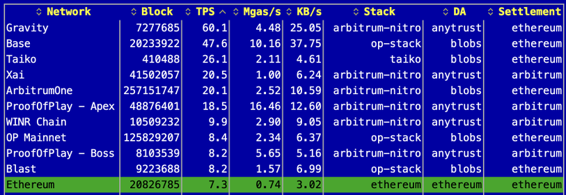
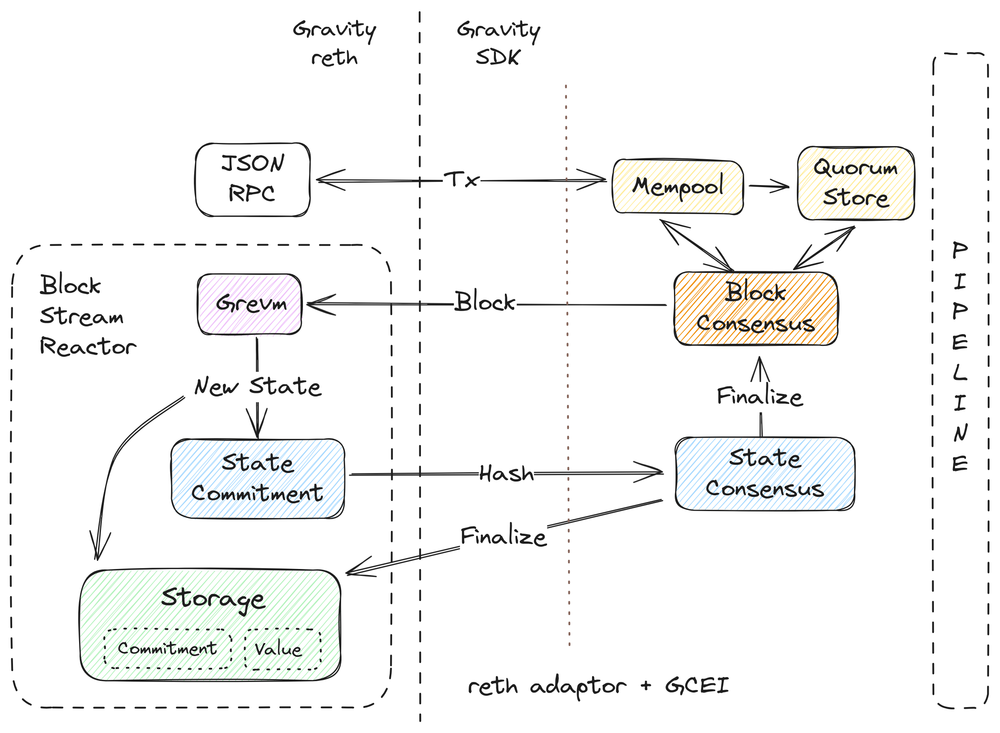
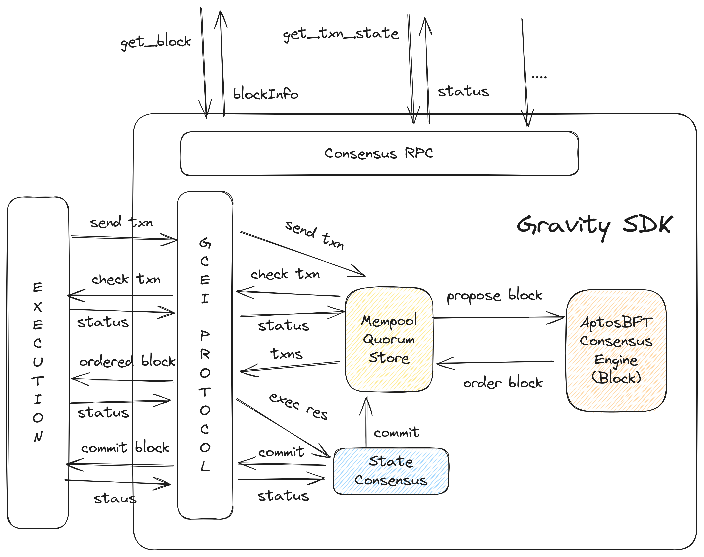
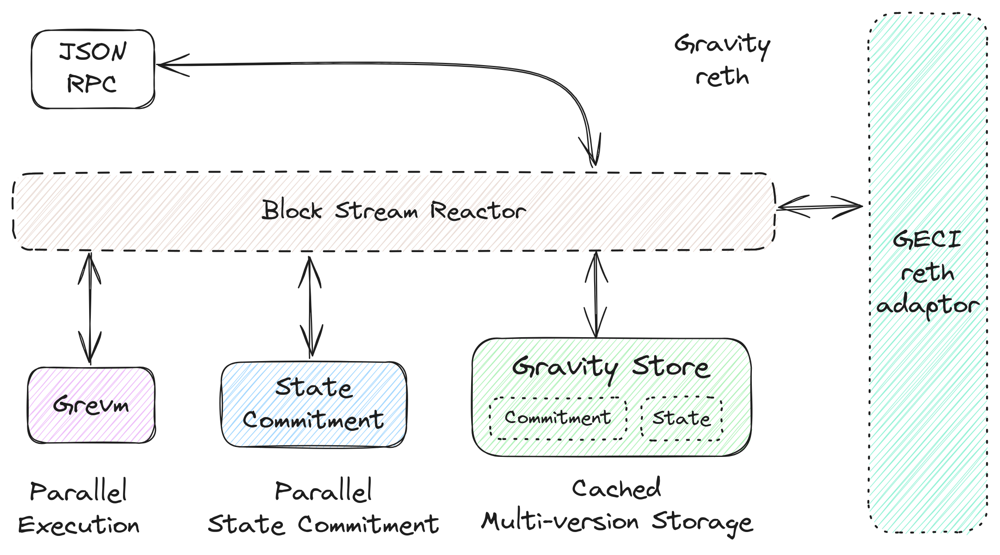
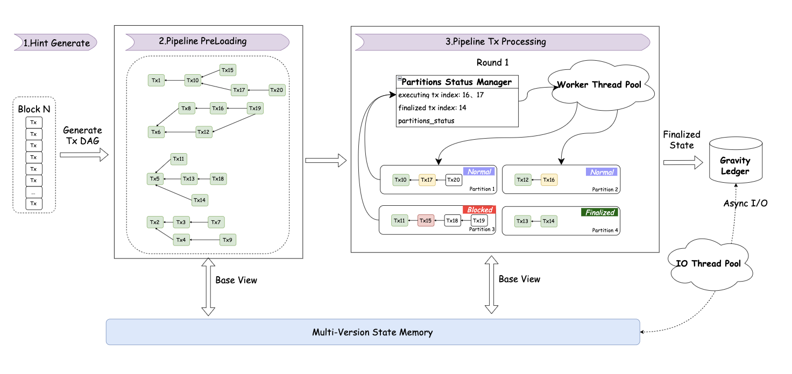
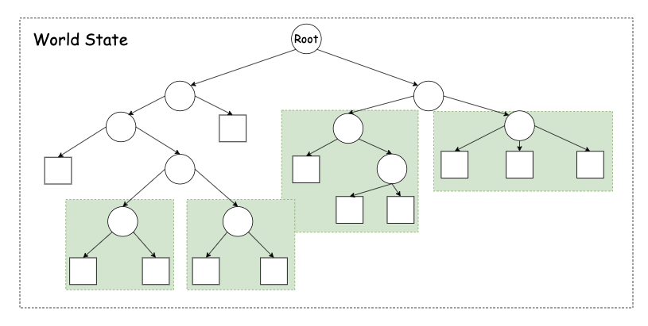
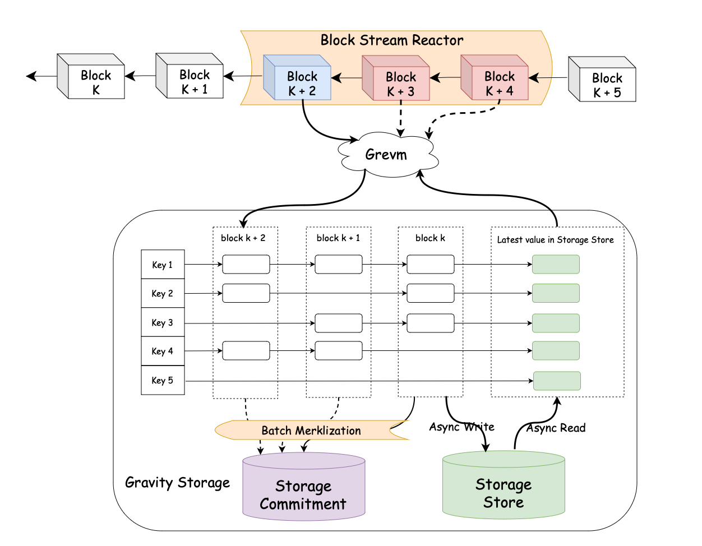

# Gravity Chain: 基于 Grevm 和 Gravity SDK 的高性能 EVM 链

> 中文版由大语言模型翻译。不准确的部分请参考英文原文。

## 摘要

**Gravity** 是 Galxe 打造的高性能、EVM 兼容的 Layer-1 区块链，专为大规模应用和多链生态设计。其特色包
括 **每秒 1 gigagas 的吞吐量**、**亚秒级交易最终确认** 和依托**再质押协议**的 PoS 共识机制。Gravity
的设计依托两大核心开源组件：(1) **Gravity SDK**，它是一种基于再质押的流水线式 AptosBFT PoS 共识引擎
；(2) **Gravity reth**，一个采用并行 EVM **Grevm (Gravity EVM)** 驱动的执行层。这些工具为 Web3 应用
程序提供了构建替代 Layer-1 和高效 Layer-2 的能力，尤其在 EVM 链上表现突出。本文深入探讨 Gravity 的工
程设计和技术创新，展示如何通过流水线架构、先进的共识算法、并行执行技术以及优化的存储机制（通过增强
[reth](https://github.com/paradigmxyz/reth) 和改良 [Aptos](https://github.com/aptos-labs/aptos-core)
共识引擎）来满足高性能需求。

## 引言

Gravity 的开发起源于 Galxe 在运营中遇到的挑战。Galxe 是一款领先的 Web3 应用，为用户提供忠诚度积分、
活动 NFTs、代币奖励、零知识身份验证以及多链智能储蓄等服务。随着 Galxe 快速发展，其忠诚度积分系统每秒
平均处理 51.2 笔交易，而代币奖励活动平均每秒处理 32.1 笔交易。在逐步去中心化 Galxe 的过程中，将这些
用例迁移到 EVM 区块链，同时确保流畅的用户体验成为了一项难题。因此，开发一条高性能 EVM 区块链，能够满
足 (1) 高交易吞吐量和 (2) 几乎即时的交易确认，变得至关重要。

在这一背景下，选择现有 Layer-2 解决方案或开发新的 Layer-1 是关键决策点。Layer-1 借助共识算法实现最终
性，而 Layer-2 借助 Rollup 协议解决这个问题。二者存在取舍：Layer-1 通常因共识算法限制而牺牲部分吞吐
量，但能实现更快的交易最终确认。例如，基于 AptosBFT 的共识算法可在亚秒级确认交易，而乐观 Rollup 可能
因挑战期长达七天。尽管零知识证明可加快这一流程，最终确认仍需数小时。考虑到 Gravity 对亚秒级最终确认
的需求（尤其是其全链意图协议），我们选择构建 Layer-1。

尽管 Layer-2 在与以太坊通信上有原生优势，但像 Gravity 这样的 Layer-1 可通过 Gravity 意图协议和跨链桥
，实现与以太坊及其他区块链的深度互操作性。这种设计不仅与以太坊无缝协作，也增强了整个 Web3 生态的连通
性。

此外，再质押协议 (restaking) 显著降低了构建 PoS Layer-1 区块链的难度。Gravity 借助 EigenLayer 和
Babylon 等协议，整合了以太坊和比特币的质押资产及其广泛的验证者网络。这为 PoS 共识提供了经济保障，使
Gravity 的去中心化与安全性达到与以太坊相当的水准。

综上所述，Gravity 被构建为一个高性能、EVM 兼容的 Layer-1 区块链，以满足现代 Web3 应用的可扩展性与性
能需求。虽然其开发初衷是服务 Galxe，但 Gravity SDK 和 Grevm (Gravity EVM) 提供的灵活框架，适合用来构
建任何 Layer-1 和高效 Layer-2，功能类似 Tendermint/Cosmos SDK。

#### 我们需要 1 gigagas/s 的吞吐量

对于区块链来说，吞吐量是最关键的性能指标，通常以每秒交易数（TPS）或每秒 gas 使用量（gas/s）来衡量。
以 Galxe 的忠诚点系统为例，它要求至少达到 400 万 gas/s 才能稳定运行。这一数据来源于每笔忠诚点交易平
均消耗 80,000 gas，同时每秒能处理约 51.2 笔交易，由此计算得出。

这一预测得到了 Gravity Alpha Mainnet 的实践数据支持。作为我们测试中的 Layer 2 网络，Gravity Alpha
Mainnet 的忠诚点交易显示其吞吐量可以稳定达到 400 万 gas/s，验证了前述估算的准确性。

虽然链上操作的高成本可能会导致需求小幅下降，但 Galxe 的扩张趋势显示，在高峰时段需求可能会提升至当前
水平的两到三倍。此外，随着其他应用场景的加入，如 NFT、代币奖励，以及未来的零知识证明支持的全链任务，
如果 Galxe 完全链上化，预计吞吐量需求将达到 5000 万 gas/s。而假设 Gravity 链上的应用 gas 使用遵循帕
累托分布（类似于 Uniswap 一直消耗以太坊 10% 的 gas ），为满足更广泛的生态需求，如跨链结算、忠诚点交
易和 NFT 市场，理想情况下应支持 5 亿 gas/s 的吞吐量。因此，为满足这些潜在需求，区块链必须具备每秒 1
gigagas 的处理能力，确保它能适应资源密集型应用的扩展。

为了达到如此高的吞吐量，关键是引入并行 EVM。我们开发了 Grevm，这是当前最快的开源并行 EVM 执行系统，
具体性能可以参见后续章节。

#### 亚秒级的确认时间

吞吐量之外，交易的确认速度对于用户体验也至关重要。现代用户习惯了类似 Web2 的几乎即时响应，而这对区块
链来说仍然是一个挑战。以 Galxe 为例，它与完全链上游戏类似，对低延迟有一定要求。目前，大多数 EVM 区块
链的交易确认时间从数秒到数天不等，远远不能满足这一要求。我们选择 AptosBFT 共识算法来实现亚秒级的确认
时间。

尽管 L2 Rollup 在理论上能提升吞吐量，但它们的挑战期会导致交易延迟，这对需要即时交易确认的应用（如
Galxe）非常不利。虽然一些 DApp 尝试通过信任模式或外部监控来优化这一点，但引入了额外的复杂性与风险，
对于关键应用并不理想。Gravity SDK 通过设计五阶段流水线，将共识和执行流程并行化，缩短了 L2 和 L1 的性
能差距（具体设计详见后文）。

#### 基于再质押 (Restaking) 的 PoS 安全

Gravity SDK 提供了一种安全扩展以太坊的方法，不局限于 L2 Rollup，而是选择通过再质押保护的 L1 架构，平
衡性能、互操作性和安全性。核心模块集成 EigenLayer 和 Babylon 等再质押协议，提供了经济信任支持，为构
建稳健的权益证明共识提供保障。

借助以太坊的 450 亿美元质押资产和 85 万验证者，以及通过 Babylon 接入比特币的 6000 亿美元资产
，Gravity 能从一开始就建立坚实的安全基础，避免新区块链常见的启动问题及安全隐患，同时长期降低单一资产
带来的系统性风险。

## Gravity Chain 架构

Gravity Chain 包含两个主要组件：Gravity SDK 和 Gravity reth。Gravity SDK 是一种改进自 Aptos 链的区块
链框架，Aptos 是目前最先进的基于 PBFT 共识算法家族的 PoS 区块链，其流水线架构极大提升了吞吐量和资源
效率。Gravity reth 是基于 reth 的执行层，以块流反应器（BSR）的形式运行，用于接收来自共识层的提议区块
。通过优化 reth，Gravity reth 实现了并行执行、批量异步状态提交计算以及存储效率提升。这两个组件通过
Gravity 共识引擎接口（GCEI）和 reth 适配器紧密结合，由流水线控制器动态管理每个阶段的进度。

该设计将区块执行从区块共识中分离，使执行层作为区块提议的消费者。我们对 reth 的优化，使其完美适应由块
流反应器（BSR）管理的流水线区块提议流程。

Gravity Chain 的交易流程如下：

1. 交易通过 Gravity reth JSON RPC 接口提交，该接口完全兼容以太坊。
2. 随后，交易进入 Gravity SDK 的内存池并在网络中传播，验证者对交易进行批量处理并生成 Quorum
   Store（QS）证书。
3. 每轮次的领导者提出一个区块提案，包含区块元数据和从内存池及 QS 中选取的有序交易。
4. 提案被标记为有序后，将进入执行层。
5. 执行层的 Grevm 并行处理交易，生成执行结果，并将新状态传递至状态管理模块。
6. 状态模块计算状态根并传递给共识引擎以达成状态根共识。
7. 状态根最终确认后，存储模块持久化状态根和区块数据。

接下来的章节将详细介绍每个组件。

## Gravity SDK：开源流水线区块链的创新实践

Gravity SDK 是一种模块化开源区块链框架，基于生产就绪的 Aptos 区块链开发。其目标是模块化 Aptos 的架构
，借鉴已验证的组件如 Quorum Store 和 AptosBFT 共识引擎，打造首个流水线区块链 SDK。

Gravity SDK 选择 Aptos 作为基础的原因包括：

- **顶级技术架构**：Aptos 是基于 PBFT 系列共识的最先进 PoS 区块链。通过引入
  [Order Votes (AIP-89)](https://github.com/aptos-foundation/AIPs/blob/main/aips/aip-89.md)，AptosBFT
  将共识延迟降低到了 3 跳，这是基于 BFT 共识协议的理论最佳限制。
- **极致性能表现**：Aptos 提供每秒 16 万笔交易的吞吐量，并且最终确认时间低于 1 秒。
- **实战可靠性**：Aptos 已通过生产环境的验证，表现出卓越的稳定性和高效性。
- **快速且持续的创新**：Aptos 正以惊人的速度不断发展。在过去两年中，
  [超过 100 项 Aptos 改进提案（AIPs）](https://github.com/aptos-foundation/AIPs/wiki/Index-of-AIPs)
  已被提交、讨论、实施并上线到 Aptos 主网。Aptos 对改进的这种不懈追求，使其始终处于区块链技术的前沿
  ，如同北极星般持续指引着 Gravity SDK 和基于该框架构建的区块链发展方向。
- **避免重复造轮子**：利用 Aptos 的成熟架构可以规避从零开发的复杂性和潜在风险，而其他试图超越 Aptos
  的尝试大多理论和实践不足。
- **协同增益**：随着 Aptos 的不断发展，Gravity SDK 能够无缝集成其新特性，如随机数 API，同时也通过模
  块化架构和创新安全机制反哺 Aptos。

基于 Gravity SDK 的区块链通过 Gravity 共识引擎接口（GCEI）与流水线共识引擎对接。尽管 GCEI 兼容多种执
行层，但 Gravity SDK 目前主要支持 Gravity reth。关于 GCEI 的详细内容将在后续章节中展开讨论。

#### Gravity Consensus Engine Interface (GCEI)

GCEI（Gravity Consensus Execution Interface）协议是共识层与执行层之间的通信桥梁。它规范了两层之间的
交互，确保通过流水线控制器使共识与执行流程保持同步。

传统区块链 SDK 与 Gravity SDK 的主要区别在于其流水线化的共识引擎。执行层必须实现为一个区块流反应器
（Block Stream Reactor），意味着它需要能够连续地消费提议的区块流，且状态承诺必须与交易执行异步计算。
此外，执行层需要能够向共识层提供回压信号，以便动态调整区块提议的节奏。

此外，由于 Gravity SDK 的流水线特性，执行层必须能够处理提议区块中不可执行的交易，因为内存池由于无法
访问最新的世界状态而无法严格检查任何交易的有效性：执行可能尚未完成。同时，执行结果不应阻塞后续区块的
生成，因为在 Gravity SDK 将区块共识与状态共识并行化后，执行层变成了对提议区块流的一个反应器，可以自
由地在后续阶段返回执行结果。

GCEI 协议规范定义了两组 API：

- **共识层 API**：这些 API 由 Gravity SDK 实现，用于执行层响应共识引擎提议的区块并提交状态承诺。
- **执行层 API**：这些 API 必须由执行层实现。共识引擎将使用这些 API 在将交易提议到区块之前进行尽力验
  证、流化提议的区块，并通知执行层最终的状态承诺。

从交易生命周期的角度看，GCEI 协议定义了以下内容：

1. **`check_txn`**（执行层 API）

   - **输入**：接收一个交易（`GTxn`）作为输入。
   - **输出**：返回交易的发送方地址、nonce 和 gas 限制。
   - **用途**：此方法用于共识引擎在将交易提议到区块之前运行尽力验证。此方法可以对同一交易多次调用，
     例如当交易进入内存池时、在被提议到区块之前以及状态承诺最终确定时。

2. **`submit_txn`**（共识层 API）

   - **输入**：从执行层接收一个交易（`GTxn`）。
   - **输出**：返回 `Result<()>`，表示交易是否成功添加到内存池。
   - **用途**：执行层可以使用此方法将交易提交到内存池。共识引擎随后会通过网络传播该交易，并在接收到
     一批交易后形成 Quorum Store。

3. **`recv_ordered_block`**（执行层 API）

   - **输入**：接收一个 `ordered_block`（类型为 `BlockBatch`），其中包含排序后的交易和区块元数据。
   - **输出**：返回 `Result<()>`，表示执行层是否成功接收并接受了该区块。
   - **用途**：一旦共识引擎提议了一个区块，它就会被发送到执行层进行交易执行。此方法允许执行层接收和
     处理提议的区块。

4. **`update_state_commitment`**（共识层 API）

   - **输入**：某区块编号的状态承诺（`StateCommitment`）。
   - **输出**：返回 `Result<()>`，表示状态承诺是否被本地共识引擎成功接受。
   - **用途**：执行层计算出状态承诺后，将其发送到共识层以便最终确定，即与其他验证者达成 2f+1 的轻量
     共识。如果状态承诺共识与提议区块的进度差距过大，流水线控制器将调整区块提议的节奏。

5. **`commit_block_hash`**（执行层 API）

   - **输入**：接收一组 `block_ids` 向量，表示需要提交的区块。
   - **输出**：返回 `Result<()>`，指示操作成功与否。
   - **用途**：当状态承诺最终确定时，共识层将通知执行层将区块哈希提交到区块链存储中。

#### 区块链流水线

Gravity SDK 利用五阶段流水线架构最大化硬件资源利用率，从而实现更高吞吐量和更低延迟。流水线在不同区块
之间交错执行任务，流水线管理器使用反馈机制确保区块链稳步前进。前三个阶段属于共识层，而后两个阶段属于
执行层。

各阶段解释如下：

- **阶段 1：交易传播**：此阶段高效地在验证者之间传播交易，确保在区块构建期间及时且可靠地包含交易。设
  计中解耦了交易传播与共识机制，遵循 [Narwhal & Tusk](https://arxiv.org/abs/2105.11827) 和
  [Aptos](https://aptosfoundation.org/whitepaper/aptos-whitepaper_en.pdf) 的思想，即验证者连续共享交
  易批次，利用所有网络资源并发运行。当一批交易获得 2f+1 权重签名时（形成 PoAv，即可用性证明），确保
  该批交易由至少 f+1 诚实验证者存储，使得所有诚实验证者均可检索到这些交易用于执行。

- **阶段 2：区块元数据排序**：此阶段在网络内建立一致且公认的交易和区块元数据顺序。共识机制
  （AptosBFT）遵循双链规则（2-chain rule）以提供拜占庭容错区块。区块随后将流入执行阶段，准备进行并行
  处理。

- **阶段 3（BSR）：并行交易执行**：该阶段属于执行层的一部分，在此阶段中并行执行交易。执行结果将被传
  递到状态承诺阶段。

- **阶段 4：状态承诺**：此阶段完成交易执行引起的状态变化并准备区块最终确定。状态承诺与交易执行异步计
  算，确保下一区块的执行不受当前区块状态承诺的阻碍。

- **阶段 5：状态持久化**：此阶段将已承诺的状态变化持久化到区块链存储中。最终状态根及相关数据存储在
  Gravity Store 中，该存储采用高度优化的存储引擎，设计为快速访问且可靠。同时通知内存池和 Quorum
  Store 清除未来无法再包含的交易。

### Staking 和 Restaking 模块

构建一个安全的权益证明（PoS）Layer 1 区块链是一项复杂任务，尤其是在仅依赖链上特定 Token 进行质押的情
况下。这种方法在早期阶段可能面临经济安全性不足的问题，例如 Token 价值波动或验证者参与度有限等。为了
解决这一问题，Gravity SDK 提供了一个灵活的 Staking 和 Restaking 模块，旨在通过本地和外部的质押机制提
升网络的安全性。

Gravity SDK 的关键策略之一是引入了 [EigenLayer](https://www.eigenlayer.xyz/) 和
[Babylon](https://babylonlabs.io/) 等 Restaking 协议。这些协议允许验证者将其他成熟网络（如以太坊和比
特币）的资产重新质押，从而利用其现有的安全保障。通过允许验证者抵押这些链的资产，Gravity SDK 能够提升
网络的经济安全性，而无需完全依赖本地 Token。这种方法不仅增强了链的稳健性，还推动了验证者生态系统的多
样性。Staking 模块的设计以模块化为核心，其 Restaking 组件具有高度的灵活性，能够随着区块链生态系统的
演变轻松适配新的 Restaking 协议。

该模块不仅支持 Restaking 资产，还支持在支持链上质押自定义 ERC20 Token，例如以太坊上的 G Token。验证
者可以通过质押这些允许的 Token 参与共识，为网络的安全性做出贡献。验证者的投票权根据其总质押价值计算
，包括自定义 Token 和 Restaking 协议中的资产。这一计算依据链的具体配置进行，确保每条链可以根据自身需
求灵活设置质押和再质押规则。

共识引擎中的 Epoch 管理器与 Staking 模块直接协作，用于计算下一轮验证者集合的权重。它通过从执行层获取
质押值，确保共识过程能够准确反映最新的质押动态。在此架构中，跨链资产（例如来自以太坊的质押资产）必须
首先桥接到执行层，然后才能用于计算验证者的总质押值。桥接机制的实现由执行层负责，这样可以更灵活地处理
跨链通信。可能的解决方案包括 PoS 桥、链状态的零知识证明，以及嵌入式自启动跨链消息传递。

更多技术细节、API 设计及 Staking 和 Restaking 机制的完整说明将会在后续文档中详细介绍。

## Gravity Reth: A Block Stream Reactor EVM Execution Layer

在 Gravity SDK 架构中集成以太坊虚拟机（EVM）执行层带来了独特的挑战，特别是在充分利用其流水线共识引擎
的能力时。为了实现无缝集成并充分发挥该架构的潜力，我们需要对开源以太坊客户端 reth 进行多项关键优化。
这些优化从根本上将 reth 转变为 Gravity reth，一种为流水线共识引擎量身定制的流水线优化 EVM 执行层。

传统区块链架构按顺序处理区块，确保每个区块在提议下一个区块之前完全验证和执行。然而，Gravity SDK 采用
了一种流水线共识机制，将区块处理的各个阶段分离开来以提高性能。这一范式的转变引入了复杂性：

1. **意外交易**：在流水线链中，由于先前区块的执行可能尚未完成，内存池无法访问最新的世界状态。因此，
   提议区块中包含的交易在提议时可能无法执行，因为在没有最新状态的情况下，其有效性无法被严格验证。

2. **非阻塞执行结果**：为了防止流水线停滞，执行结果不应阻止后续区块生成。执行层必须能够异步处理提议
   区块，并在稍后阶段返回执行结果而不阻碍共识过程。对于 EVM，这意味着需要重新定义 `blockhash`，消除
   对区块头中 `stateRoot` 字段的依赖。

为了解决这些问题，我们引入了四项关键优化：

- **区块流反应器（Block Stream Reactor, BSR）**：BSR 旨在将 reth 调整为 Gravity SDK 的流水线区块提议
  流程。它使执行层能够持续消费提议区块流，作为一个异步处理区块的反应器。BSR 与共识引擎建立了一个动态
  反馈循环，结合适当的回压信号。这些信号根据执行层的吞吐量和延迟实时调整区块提议和状态提交的速度。如
  果由于复杂交易或资源限制导致执行层滞后，回压机制会降低区块提议速率，以确保系统稳定。

- **状态提交与交易执行的解耦**：第二项优化涉及将状态提交计算与交易执行分离。通过解耦这些过程，我们实
  现了状态提交计算的异步化，使后续区块的执行无需等待当前区块的状态提交完成。我们重新定义了
  `blockhash`，去除了对区块头中 `stateRoot` 字段的依赖，确保状态根计算不会阻止后续区块生成。

- **存储层优化**：在流水线架构中，高效缓存和持久化多版本状态值与状态提交至关重要。第三项优化侧重于增
  强存储层以满足这些需求而不引入瓶颈。通过优化存储机制，我们确保状态数据能够快速写入并高并发检索。这
  包括构建多版本存储引擎和支持从数据库到存储 API 的异步 I/O。

- **并行 EVM**：最后一项优化涉及并行化 EVM 内的交易执行。我们开发了 Grevm，一种并行 EVM 运行时，通过
  并发执行交易显著加速交易处理。Grevm 利用从交易模拟中获得的数据依赖提示优化并行执行，减少交易重新执
  行并提高吞吐量。

### Grevm（Gravity EVM）- 并行 EVM 执行

> Grevm 是一个开源项目，托管在 GitHub 上（如果尚未开源，未来将会开源）。请参阅其
> [README](https://github.com/Galxe/grevm/blob/main/README.md) 获取更多信息。

[Grevm（Gravity EVM）](https://github.com/Galxe/grevm) 是基于
[revm](https://github.com/bluealloy/revm) 的开源并行 EVM 运行时。Grevm 的算法灵感来自
[BlockSTM](https://arxiv.org/abs/2203.06871)，并通过引入从模拟结果中获得的交易数据依赖图加以增强。该
机制使并行执行调度更加高效，最大限度地减少交易重新执行。

在我们的基准测试中，Grevm 是目前最快的开源并行 EVM 实现。对于无冲突交易，Grevm 比顺序执行快 **4.13
倍**，运行速度达到 **26.50 gigagas/s**。如果模拟真实世界 **100 μs** 的 I/O 延迟，其速度是顺序执行的
**50.84 倍**，吞吐量为 **6.80 gigagas/s**。这种性能的飞跃归功于并行化执行与异步 I/O 操作的集成——并行
化使得 I/O 操作能够高效地重叠，从而进一步加速。

Grevm 的核心思想是利用交易间的数据依赖性，通过推测的交易读/写集来优化并行执行。尽管所有提示并非完全
准确，但这些基于模拟的提示通常足够实用。例如，在以太坊主网上，根据 **历史 Gas 使用情况**，大约 30%
的交易是简单的以太币转账，另有 25%-30% 是 ERC20 代币转账，这些交易通常只涉及读取和写入有限数量的账户
和存储槽。对于这些交易，模拟结果具有一致的准确性。

基于这些见解，我们为 Grevm 开发了一个 **三阶段并行执行框架**，作为 **Block-STM** 模型的后续工作，并
结合了从交易模拟中获得的数据依赖提示：

- **阶段 1**：**提示生成与状态预加载**——模拟交易以收集依赖提示并预热内存缓存。此阶段可以在不同时间点
  执行，具体取决于区块链的设计。例如，当新交易到达内存池时，可以立即运行模拟以提前准备依赖提示。
- **阶段 2**：**依赖分析**——将模拟阶段收集的依赖提示转化为表示交易间依赖关系的有向无环图（DAG）。此
  DAG 用于规划后续并行执行中的交易调度。
- **阶段 3**：**冲突解决下的并行执行**——使用基于依赖 DAG 的修改版 BlockSTM 算法并行执行交易。调度程
  序不再严格按照区块中交易的序列号（如 1, 2, 3, ..., n）选择交易，而是优先根据 DAG 排序交易，以最小
  化冲突并减少重新执行需求。

### 异步批量状态提交

状态提交的生成仍然是区块链流水线中的一个关键瓶颈，源于默克尔化本质上的顺序性。每个子树计算必须完成后
才能生成最终状态提交，这会导致显著延迟。尽管现有解决方案（如
[reth 的账户级并行化](https://www.paradigm.xyz/2024/04/reth-perf#:~:text=in%20EVM%20execution.-,Improving%20the%20State%20Commitment,-We%20recently%20wrote)）
引入了一定程度的并行性，但仍有大量优化空间。在 Gravity reth 的区块流反应器（BSR）执行层背景下，状态
提交共识与交易执行解耦，可以异步进行推迟和批量的状态提交计算而不阻塞执行。

为了解决这些问题，提出的框架引入了以下关键创新：

**异步批量哈希计算**：利用状态提交共识与交易执行的解耦，该框架实现了状态提交的异步计算。状态根更新按
批次（如每 10 个区块计算一次）进行，以减少状态根计算的频率。这种批量处理方法通过聚合共享的脏节点实现
高效哈希计算，从而最大限度地减少频繁更新的开销并降低总体计算成本。对于小区块，批量处理可以显著提高并
行性；对于大区块，则可减少总体计算成本。

**完全并行化**：该框架将并行化扩展至整个状态树，而不仅仅是单个账户树。对于标记为“脏”的节点，框架采用
并行状态计算算法，将树划分为独立的子树并并发处理这些子树。结果在顶层聚合以高效计算最终根。这种方法确
保拥有大量交易和状态变化的大区块能够充分利用多线程，从而最大化吞吐量。

**替代快速状态根**：为适应以太坊的区块头和 `BLOCKHASH` 操作码（需要访问最近 256 个区块的状态根），我
们重新定义了状态根。与依赖于最终状态提交（在交易执行期间不可用）不同

，我们将状态根计算为区块变更集与之前状态根的哈希值组合。这种方法使得状态根计算更快，无需等待完整的状
态提交完成。

### Gravity Store

为了满足高性能区块链对大规模数据管理的需求，Gravity Store 作为一个优化的多版本存储层应运而生。它基于
reth 的设计，reth 已经通过将状态提交存储和状态数据存储分离来减少状态膨胀问题，同时降低了数据读写的开
销。然而，Gravity reth 的执行层需要进一步支持并行处理和异步状态提交，提出了更多的技术需求。

为了解决这些挑战，Gravity Store 提出了高效的多版本树结构，专门为我们的 BSR（Block Stream Reactor）架
构量身定制。这种树结构支持管理多版本的状态更新。不同于修改后立即更新哈希值的传统做法，Gravity Store
会将修改过的节点标记为“脏节点”，从而实现哈希计算的延迟处理与批量执行。这种设计允许快速创建新版本、高
效查询指定版本数据，并清理低于指定高度的旧版本，大幅提升区块链状态管理的性能。

我们还在研究独立开发存储引擎 Gravity DB，其设计目标是为区块链应用提供优化的存储层，并支持完全异步的
I/O 操作。该引擎的设计灵感来自 [LETUS](https://dl.acm.org/doi/abs/10.1145/3626246.3653390)，一种面向
区块链的高性能日志结构化通用数据库引擎。我们的首席开发人员 Richard 作为 LETUS 的主要作者之一，将在即
将发布的博客文章中详细介绍其设计。

## 结论

Gravity Chain 是一个高性能的 EVM 兼容第一层区块链，专为满足现代 web3 应用的可扩展性和性能需求而设计
。结合 Gravity SDK、管道化的 AptosBFT PoS 共识引擎，以及由 Grevm 驱动的 Block Stream Reactor 执行层
Gravity reth，Gravity 实现了每秒 1 gigagas 的交易吞吐量、亚秒级的交易确认时间，以及基于再质押机制的
PoS 安全性。这些技术组件的设计，为 web3 应用创建自定义的替代 L1 区块链或更高效的 L2 解决方案提供了坚
实的基础，特别适合优化 EVM 链的使用场景。
